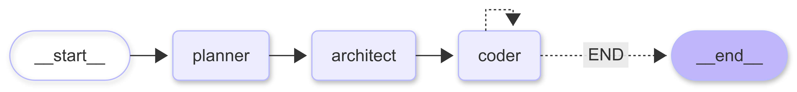

# Coder Buddy
Coder Buddy is a simple application built using agentic AI and prompt engineering. It helps users generate, refine, and test code snippets interactively, showcasing how lightweight agent workflows can be applied to practical coding tasks with minimal setup.

## Tech Stack
- **LangChain**: Framework for building LLM-powered applications, prompt chains, and tools. [LangChain Docs](https://python.langchain.com)
- **LangGraph**: Library for building stateful, multi-actor agent workflows on top of LangChain. [LangGraph Docs](https://langchain-ai.github.io/langgraph/)
- **Groq Cloud**: Low-latency inference platform for running LLMs; used as the model provider. [Groq Cloud](https://groq.com)
- **uv**: Ultra-fast Python package and project manager for reproducible environments and builds. [uv by Astral](https://github.com/astral-sh/uv)

## Setup with uv
To install all dependencies declared in `pyproject.toml`, run:

```bash
uv sync
```

This will resolve and install the full dependency set (and create/manage a virtual environment) specified in `pyproject.toml`, ensuring your local environment matches the project requirements.

### Activate the virtual environment
If you prefer to work inside the environment directly, activate the venv created by uv:

```bash
source .venv/bin/activate
```

## Environment Variables
This project uses environment variables stored in a local `.env` file (loaded via `python-dotenv`).

- **GROQ_API_KEY**: API key for Groq Cloud. Used to authenticate requests to Groq-hosted LLMs (fast, low-latency models; free tier available). Required for running the agent with Groq as the model provider.

Setup:

```bash
cp .env.example .env
# Edit .env and set your key
# GROQ_API_KEY=your_real_key
```

Alternatively, export it in your shell session:

```bash
export GROQ_API_KEY=your_real_key
```

This project uses Groq Cloud as the LLM backend (free tier available); setting `GROQ_API_KEY` is required to authenticate requests.

## Run the agent
Run the main graph with either uv (recommended) or plain Python:

```bash
# Using uv (no need to manually activate the venv)
uv run python agent/graph.py

# Or with Python (requires the venv to be activated first)
python agent/graph.py
```

# 🛠️ Coder Buddy

**Coder Buddy** is an AI-powered coding assistant built with [LangGraph](https://github.com/langchain-ai/langgraph).  
It works like a multi-agent development team that can take a natural language request and transform it into a complete, working project — file by file — using real developer workflows.

---

## 🏗️ Architecture

- **Planner Agent** – Analyzes your request and generates a detailed project plan.
- **Architect Agent** – Breaks down the plan into specific engineering tasks with explicit context for each file.
- **Coder Agent** – Implements each task, writes directly into files, and uses available tools like a real developer.

<div style="text-align: center;">
    
</div>

---

## 🚀 Getting Started
### Prerequisites
- Make sure you have uv installed, follow the instructions [here](https://docs.astral.sh/uv/getting-started/installation/) to install it.
- Ensure that you have created a groq account and have your API key ready. Create an API key [here](https://console.groq.com/keys).

### ⚙️ **Instsllstion and Startup**
- Create a virtual environment using: `uv venv` and activate it using `source .venv/bin/activate`
- Install the dependencies using: `uv pip install -r pyproject.toml`
- Create a `.env` file and add the variables and their respective values mentioned in the `.sample_env` file

Now that we are done with all the set-up & installation steps we can start the application using the following command:
  ```bash
    python main.py
  ```

### 🧪 Example Prompts
- Create a to-do list application using html, css, and javascript.
- Create a simple calculator web application.
- Create a simple blog API in FastAPI with a SQLite database.

